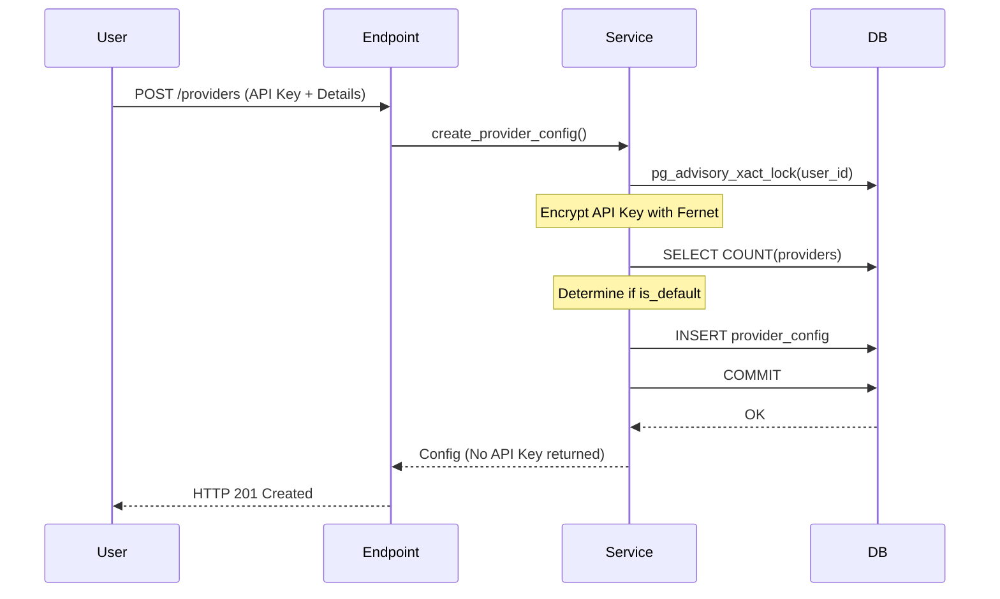

# 06 — Phase 0.5 Provider Foundation

This document outlines the design decisions, implementation details, and safety guarantees introduced in Phase 0.5 (Foundation Reset).

## Purpose & Context
As ScrapGPT transitioned from a credit-gated SaaS backend to a self-hosted, Bring-Your-Own-Key (BYOK) platform, we needed to:
1. **Remove artificial resource bounds**: Strip out the legacy credits table, columns, daily reset tasks, and credit verification logic.
2. **Securely store provider keys**: Support user-scoped providers (e.g. OpenAI, Anthropic, Gemini) while ensuring their API keys are encrypted at rest.
3. **Limit concurrent jobs**: Enforce resource protection rules using operator settings (`MAX_CONCURRENT_JOBS_PER_USER`) instead of credit limits.

---

## Design Decisions
1. **Fernet Encryption at Rest**:
   - API keys are encrypted using Fernet (symmetric authenticated encryption).
   - Encryption secret `PROVIDER_KEY_ENCRYPTION_SECRET` is stored separately from the web auth `SECRET_KEY`. This isolation prevents compromised session tokens from exposing stored provider keys.
   - Key loss is permanently unrecoverable. Startup checks fail loud and early if the encryption key is malformed or missing.
2. **Database Advisory Locks for Provider Configuration**:
   - Setting a provider config as the default requires updating other rows. To prevent race conditions, we use PostgreSQL advisory transaction locks (`pg_advisory_xact_lock`) keyed by user ID to serialize write requests per user.
3. **Count-based Admission Control**:
   - The original 1-active-task-per-user constraint (backed by a partial unique index) was replaced with a count check against `MAX_CONCURRENT_JOBS_PER_USER`.
   - To prevent TOCTOU race conditions when submitting tasks, the count query is guarded by `pg_advisory_xact_lock` on the user ID during task admission.

---

## Code Walkthrough
- **`app/models/provider_config.py`**: Defs the `ProviderConfig` model containing provider metadata, capability flags (Connectivity, JSON, Native JSON), and the encrypted API key.
- **`app/services/provider_service.py`**:
  - `encrypt_api_key(api_key)` / `decrypt_api_key(api_key_encrypted)`: Uses `cryptography.fernet.Fernet` loaded with `PROVIDER_KEY_ENCRYPTION_SECRET`.
  - `call_json_model(...)`: Unified LiteLLM call wrapper. If a provider native structured JSON format fails, it falls back to a strict schema text prompt and retries.
  - `test_provider_config(...)`: Tests model connectivity and updates the config's `capability_flags`.
- **`app/api/v1/endpoints/providers.py`**: Implements endpoints for CRUD operations and connectivity checks. It catches `IntegrityError` to gracefully handle default-provider conflicts with HTTP 409.

---

## Lifecycle & Flow

- **On Success**: The API key is encrypted and saved. If it's the user's first provider or marked default, it clears existing defaults and sets the user's `default_provider_id`.
- **On Failure**: If the database throws a duplicate key constraint on the unique default constraint (due to a race condition), the transaction rolls back, and Endpoint returns `409 Conflict`.

---

## Concurrency & Failure Analysis
- **Race Condition (Default Provider)**: If two threads write a default provider simultaneously, `pg_advisory_xact_lock` forces one thread to wait. If the advisory lock is bypassed (e.g. manual DB updates), the database's unique partial index constraint (`ix_provider_configs_one_default_per_user`) triggers `IntegrityError`, which the API handles gracefully.
- **Crash Mid-Transaction**: Writes happen inside an atomic database transaction. If the app server crashes mid-write, the database engine aborts the transaction, preserving the default provider integrity.
- **Incorrect Key Encryption Secret**: If the environment's `PROVIDER_KEY_ENCRYPTION_SECRET` is changed without migrating database records, decryption will throw a Fernet `InvalidToken` error. The setup docs and `.env.example` warn users to back up this secret.

---

## Things to Be Careful About
- **Never Log Plaintext Keys**: `api_key` material must never enter logging or exception contexts.
- **Do Not Expose Keys**: Return schemas (`ProviderConfigResponse`) must exclude both `api_key` and `api_key_encrypted`.
- **Keep Startup Validation**: The Pydantic validation on `PROVIDER_KEY_ENCRYPTION_SECRET` in `config.py` MUST remain on import time to prevent degraded states where a user registers API keys that can never be decrypted.

---

## Future Evolution
In Phase 2, we will integrate `ProviderConfig` directly into the background crawler. When fetching pages, the crawler will reference the provider configuration to execute repair prompts or parser prompts when selectors drift or values require normalization.

---

## Summary
Phase 0.5 establishes a secure, BYOK foundation for ScrapGPT by removing the legacy SaaS credit structure, introducing robust Fernet encryption for API keys, and serializing write pathways using advisory transaction locks.
